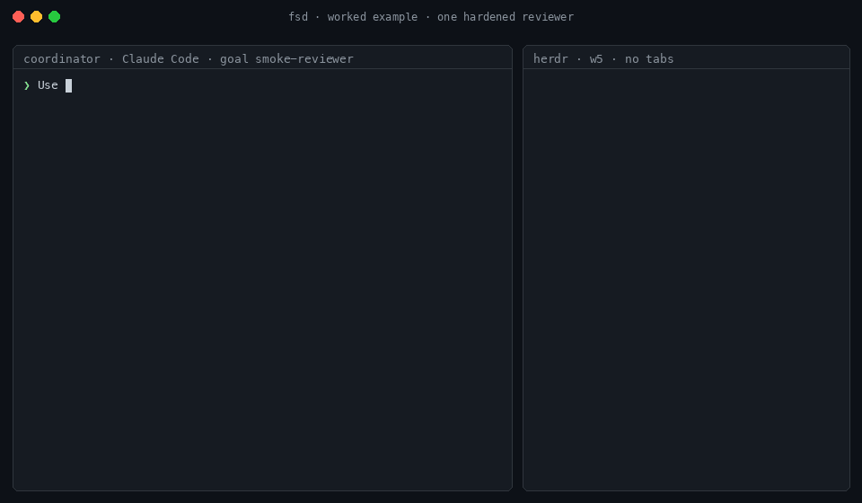

# FSD

**Coordinate coding agents from implementation through review and integration.**

[](CHANGELOG.md)
[](LICENSE)
[](#quick-start)
[](#quick-start)
[](https://herdr.dev)
[](#how-it-works)



*Illustration of the [review loop](references/compositions.md#review-loop): one builder, then a
fresh hardened reviewer, each in its own Herdr tab. Drawn from the role files, not screen-recorded;
for a real trace see the [worked example](references/example.md).*

FSD is an agent skill for organizing coding work across specialized builders, reviewers
and scouts. A coordinator — the coding agent you are already talking to — assigns focused
tasks, checks the results itself, and integrates the changes. Small tasks stay with one
agent; larger ones use parallel workers and independent review, each in its own visible
terminal that you can watch and steer.

FSD runs through tools you already have. [Herdr](https://herdr.dev), a terminal
multiplexer for coding agents, runs each worker in its own tab; Git worktrees keep
concurrent implementation apart; plain files carry assignments and reports. FSD adds no
runtime or service of its own: FSD 1.2.0 is instructions, references, role files and
record templates that any skill-capable coding agent (the *harness* —
Claude Code, Pi, Codex) can follow.

## What it looks like

> Use FSD: fix the parser regression, run the tests, and stop. No public API changes.

The coordinator confirms only what is genuinely undecided, does small work itself, and
for anything larger opens one Herdr tab per worker: a `builder` in an isolated worktree,
fresh `reviewer`s with distinct angles, a `scout` when the code is unfamiliar. Each worker
gets a role file and a short packet, publishes an immutable report, and the coordinator is
woken when it finishes — no polling. Results are verified by the coordinator, not taken
on trust.

For a complete trace of a real goal, including two coordinator mistakes and how they were
corrected, see the [worked example](references/example.md).

## Quick start

Install once per harness. Installing grants no authority and launches nothing.

```sh
# Pi
pi install git:github.com/ptshih/fsd

# Claude Code
claude plugin marketplace add ptshih/fsd
claude plugin install fsd@fsd
```

Then ask in plain language: `Use FSD: <outcome>, <constraints>, and stop.` Supervised is
the default. Request unsupervised work explicitly; that changes how in-scope decisions are
handled, not permissions or available host capabilities. Steer, pause or cancel through
the conversation.

**Prerequisites:** Herdr with its harness integrations installed, at least one supported
harness, and Git where your project requires it. Unattended delegation also needs a way
to wake the coordinator: the harness's native background-task notifications (Claude Code
and Pi have them) or a native file watcher for the report inboxes. Owner preferences (model routing per
role, approval policy, standing limits) live at `$XDG_CONFIG_HOME/fsd/preferences.json`.

## Workflow options

Five shipped roles — `scout`, `builder`, `workhorse`, `reviewer`, `judge` — each a
markdown file that fixes a worker's scope, harness launch arguments and report shape;
your preferences supply the model. Common shapes are in
[compositions](references/compositions.md): parallel review, review loop,
scout → build → review, judge, mechanical batch. None is mandatory; the coordinator picks
the smallest shape that earns its cost, or does the work directly.

## How it works

**Herdr tabs → filesystem reports → existing native wakeup → coordinator verification.**

- One coordinator. One implementation writer per working directory; concurrent writers
  get separate worktrees. Readers can share a checkout.
- Every goal pins its own copy of the skill in `runbook/`, so updating FSD never changes
  a running goal. Goal records live at `$XDG_STATE_HOME/fsd/goals/<project-slug>/<goal-id>/`,
  outside every repository.
- The wake is Herdr's settled-state `agent wait`, run through the harness's own background
  facility; an inbox file watch is the fallback. Files preserve state; they do not wake an
  idle agent by themselves.
- Receipt, verification, integration and the final outcome are kept distinct. The
  coordinator ends with **delivered**, **blocked**, **limit reached** or **cancelled**,
  with evidence.

The [skill](SKILL.md) gives the full workflow.

## Limitations

FSD is cooperative: it provides no hard spending limits, guaranteed interruption,
exactly-once effects, automatic deadline enforcement or crash-proof continuation, and it
claims only what it verified. Hardened (read-only) workers rely on the harness's own
permission modes. Cross-machine coordination is not supported.

## References

- [Setup and preferences](references/setup.md): first use, role files, upgrades.
- [Worker guide](references/worker.md): focused execution, escalation and reporting.
- [Compositions](references/compositions.md): named shapes built from the roles.
- [Worked example](references/example.md): one hardened reviewer end to end.
- [Filesystem protocol](references/filesystem.md): goal directory, ownership, messages, recovery.
- [Filesystem examples](references/recipes.md): tested one-shot commands.
- [Native wakeup](references/delivery.md): settled-state waits and inbox watches.
- [Herdr operations](references/herdr.md): launch, dispatch, inspection, cleanup.

## Development

From a source checkout with Node 22 or later, run `npm test` and `npm run check`. No
dependency installation is needed. These validate packaging, documentation, role files,
templates and exact filesystem examples in disposable local fixtures — not agent
compliance or end-to-end delivery. Update the installed skill between goals (`pi update
git:github.com/ptshih/fsd` or `claude plugin update fsd@fsd`), or rely on the per-goal
runbook pin; pin a release through the package manager when reproducibility matters.

[MIT](LICENSE) © 2026 ptshih.
